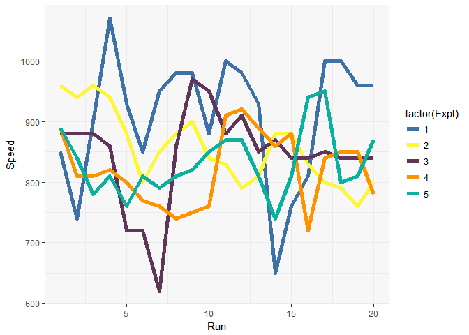
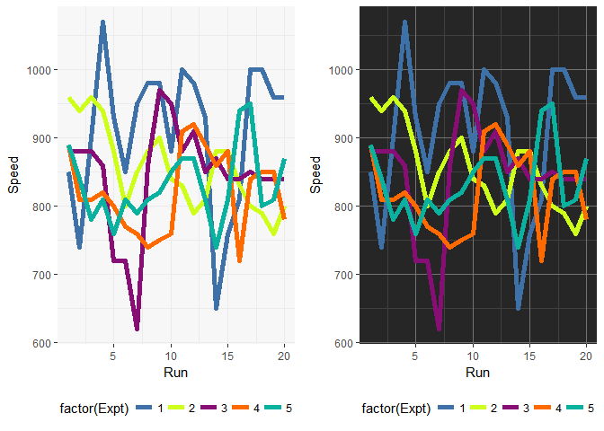
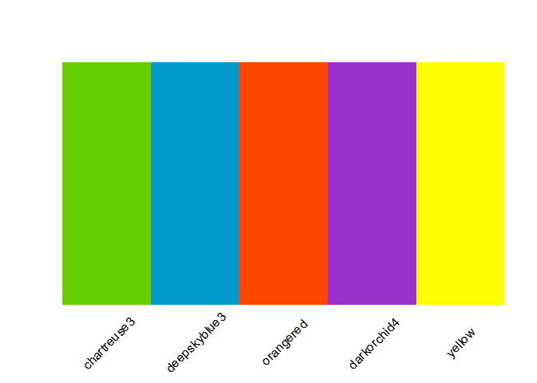

# jcolors

[](https://travis-ci.org/road2stat/ggsci)

`jcolors` contains a selection of `ggplot2` color palettes that I like

## Installation


Install `jcolors` from GitHub:


```r
# install.packages("devtools")
devtools::install_github("jaredhuling/jcolors")
```

Access the `jcolors` color palettes with `jcolors()`:


```r
library(jcolors)

jcolors('default')
```

```
##  chartreuse3 deepskyblue3    orangered  darkorchid1       yellow 
##    "#66CD00"    "#009ACD"    "#FF4500"    "#BF3EFF"    "#FFFF00"
```


Now use `scale_color_jcolors()` with `ggplot2`:


```r
library(ggplot2)

data(morley)

pltl <- ggplot(data = morley, aes(x = Run, y = Speed,
group = factor(Expt),
colour = factor(Expt))) +
    geom_line(size = 2) +
    theme_bw() +
    theme(panel.background = element_rect(fill = "grey97"),
          panel.border = element_blank())

pltd <- ggplot(data = morley, aes(x = Run, y = Speed,
group = factor(Expt),
colour = factor(Expt))) +
    geom_line(size = 2) +
    theme_bw() +
    theme(panel.background = element_rect(fill = "grey15"),
          panel.border = element_blank(),
          panel.grid.major = element_line(color = "grey45"),
          panel.grid.minor = element_line(color = "grey25"))

pltl + scale_color_jcolors(palette = "default")
```

<!-- -->

```r
pltd + scale_color_jcolors(palette = "default")
```

<!-- -->

Color palettes can be displayed using `display_jcolors()`


```r
display_jcolors("default")
```

<!-- -->
