# jcolors

[](https://travis-ci.org/jaredhuling/jcolors)

`jcolors` contains a selection of `ggplot2` color palettes that I like

## Installation


Install `jcolors` from GitHub:


```r
install.packages("devtools")
devtools::install_github("jaredhuling/jcolors")
```

Access the `jcolors` color palettes with `jcolors()`:


```r
library(jcolors)

jcolors('default')
```

```
##     chartreuse3    deepskyblue3       orangered     darkorchid4 
##       "#66CD00"       "#009ACD"       "#FF4500"       "#9A32CD" 
## titanium_yellow 
##       "#F5E400"
```

## All available palettes


```r
display_all_jcolors()
```

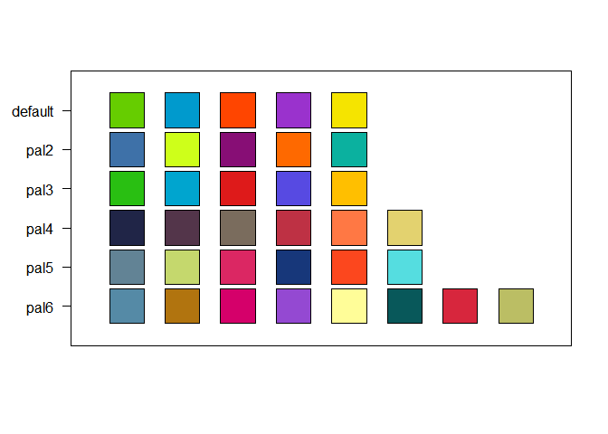<!-- -->

## Use with `ggplot2`

Now use `scale_color_jcolors()` with `ggplot2`:


```r
library(ggplot2)
library(gridExtra)

data(morley)

pltl <- ggplot(data = morley, aes(x = Run, y = Speed,
group = factor(Expt),
colour = factor(Expt))) +
    geom_line(size = 2) +
    theme_bw() +
    theme(panel.background = element_rect(fill = "grey97"),
          panel.border = element_blank(),
          legend.position = "bottom")

pltd <- ggplot(data = morley, aes(x = Run, y = Speed,
group = factor(Expt),
colour = factor(Expt))) +
    geom_line(size = 2) +
    theme_bw() +
    theme(panel.background = element_rect(fill = "grey15"),
          legend.key = element_rect(fill = "grey15"),
          panel.border = element_blank(),
          panel.grid.major = element_line(color = "grey45"),
          panel.grid.minor = element_line(color = "grey25"),
          legend.position = "bottom")

grid.arrange(pltl + scale_color_jcolors(palette = "default"),
             pltd + scale_color_jcolors(palette = "default"), ncol = 2)
```

<!-- -->

```r
grid.arrange(pltl + scale_color_jcolors(palette = "pal2"),
             pltd + scale_color_jcolors(palette = "pal2"), ncol = 2)
```

<!-- -->

Color palettes can be displayed using `display_jcolors()`

## default

```r
display_jcolors("default")
```

<!-- -->

## pal2

```r
display_jcolors("pal2")
```

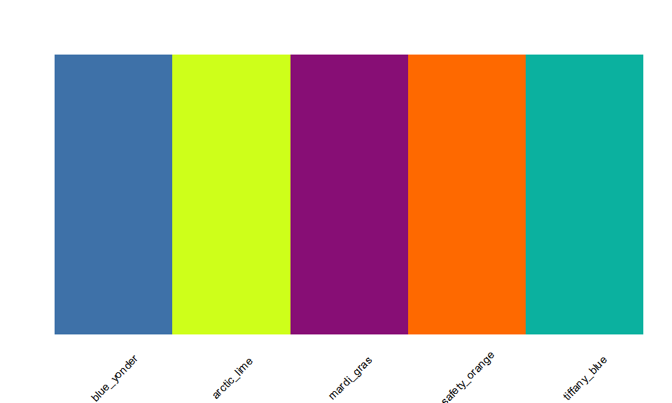<!-- -->

## pal3

```r
display_jcolors("pal3")
```

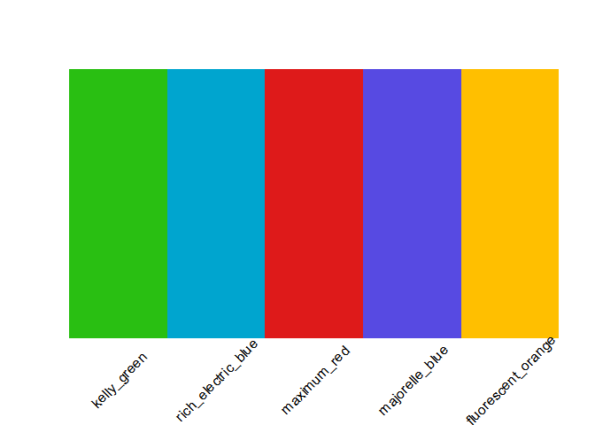<!-- -->

## pal4

```r
display_jcolors("pal4")
```

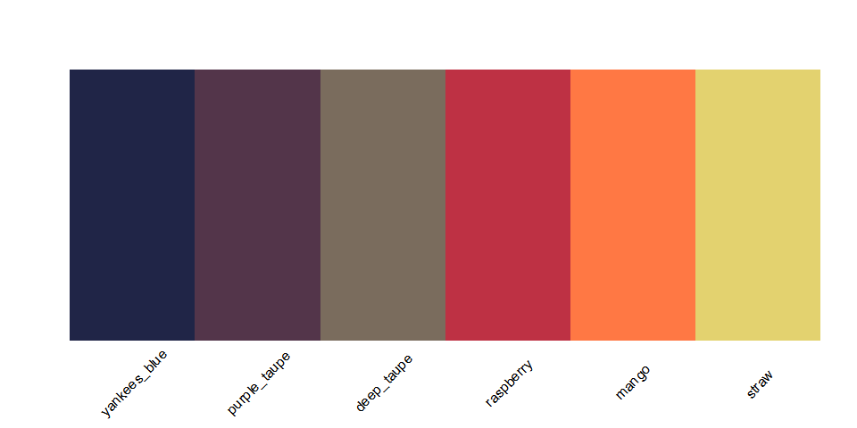<!-- -->

## pal5

```r
display_jcolors("pal5")
```

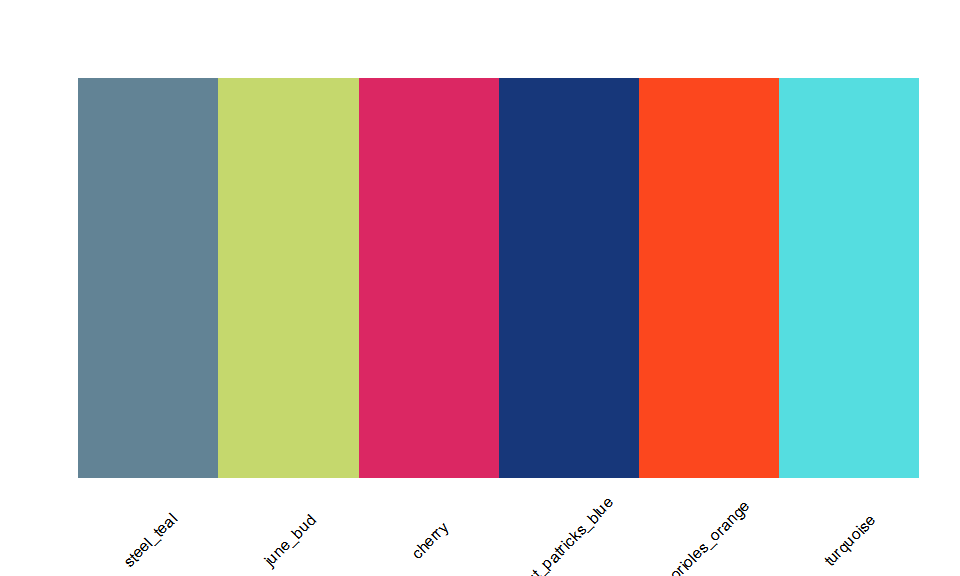<!-- -->

## pal6

```r
display_jcolors("pal6")
```

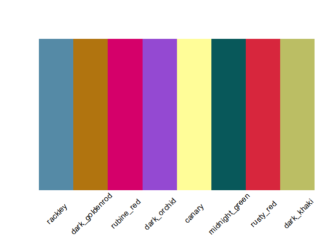<!-- -->


More example plots


```r
grid.arrange(pltl + scale_color_jcolors(palette = "pal3"),
             pltd + scale_color_jcolors(palette = "pal3"), ncol = 2)
```

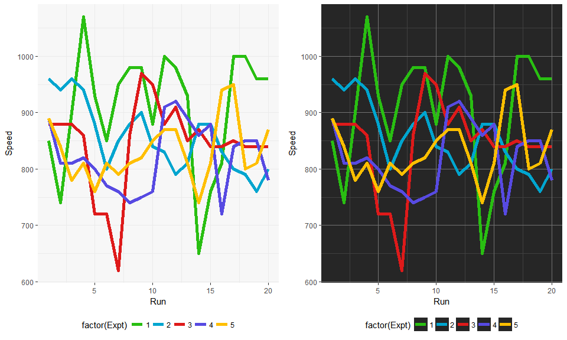<!-- -->

```r
grid.arrange(pltl + scale_color_jcolors(palette = "pal4"),
             pltd + scale_color_jcolors(palette = "pal4") + 
                 theme(panel.background = element_rect(fill = "grey5")), ncol = 2)
```

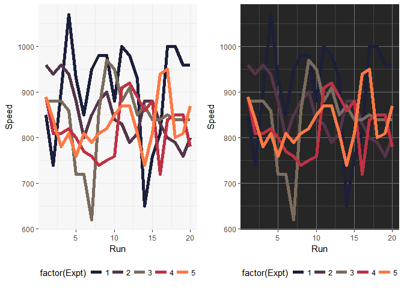<!-- -->

```r
grid.arrange(pltl + scale_color_jcolors(palette = "pal5"),
             pltd + scale_color_jcolors(palette = "pal5"), ncol = 2)
```

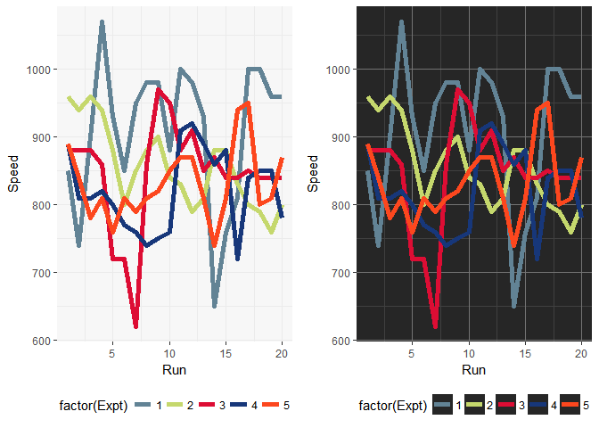<!-- -->

```r
pltd <- ggplot(data = OrchardSprays, aes(x = rowpos, y = decrease,
group = factor(treatment),
colour = factor(treatment))) +
    geom_line(size = 2) +
    geom_point(size = 4) +
    theme_bw() +
    theme(panel.background = element_rect(fill = "grey15"),
          legend.key = element_rect(fill = "grey15"),
          panel.border = element_blank(),
          panel.grid.major = element_line(color = "grey45"),
          panel.grid.minor = element_line(color = "grey25"),
          legend.position = "bottom")


pltd + scale_color_jcolors(palette = "pal6")
```

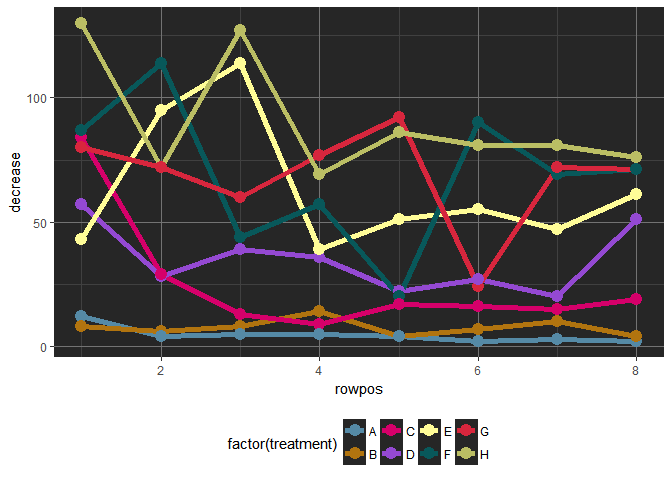<!-- -->

## Continuous Color Palettes


```r
colfunc  <- jcolors_contin()
jcols    <- colfunc(1000)
n        <- length(jcols)

colfunc2 <- jcolors_contin("pal2")
jcols2   <- colfunc2(1000)

colfunc3 <- jcolors_contin("pal3")
jcols3   <- colfunc3(1000)

par(mfrow = c(3,1), mai = c(0.1, 0.1, 0.1, 0.1))
image(1:n, 1, as.matrix(1:n),
      col  = jcols,
      xlab = "", ylab = "",
      xaxt = "n", yaxt = "n", bty = "n")
image(1:n, 1, as.matrix(1:n),
      col  = jcols2,
      xlab = "", ylab = "",
      xaxt = "n", yaxt = "n", bty = "n")
image(1:n, 1, as.matrix(1:n),
      col  = jcols3,
      xlab = "", ylab = "",
      xaxt = "n", yaxt = "n", bty = "n")
```

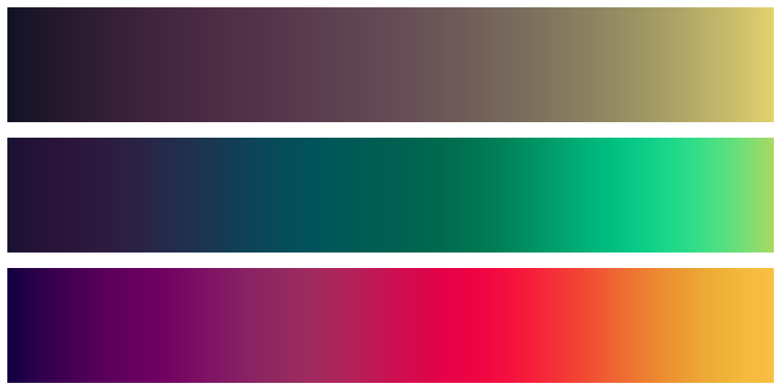<!-- -->

