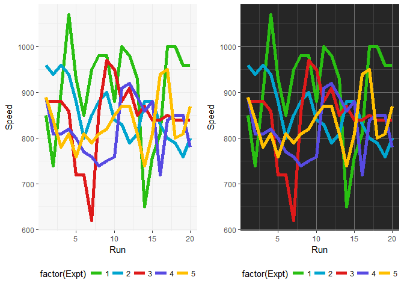

# jcolors

[](https://travis-ci.org/jaredhuling/jcolors)

`jcolors` contains a selection of `ggplot2` color palettes that I like

## Installation


Install `jcolors` from GitHub:


```r
install.packages("devtools")
devtools::install_github("jaredhuling/jcolors")
```

Access the `jcolors` color palettes with `jcolors()`:


```r
library(jcolors)

jcolors('default')
```

```
##     chartreuse3    deepskyblue3       orangered     darkorchid4 
##       "#66CD00"       "#009ACD"       "#FF4500"       "#9A32CD" 
## titanium_yellow 
##       "#F5E400"
```


Now use `scale_color_jcolors()` with `ggplot2`:


```r
library(ggplot2)
library(gridExtra)

data(morley)

pltl <- ggplot(data = morley, aes(x = Run, y = Speed,
group = factor(Expt),
colour = factor(Expt))) +
    geom_line(size = 2) +
    theme_bw() +
    theme(panel.background = element_rect(fill = "grey97"),
          panel.border = element_blank(),
          legend.position = "bottom")

pltd <- ggplot(data = morley, aes(x = Run, y = Speed,
group = factor(Expt),
colour = factor(Expt))) +
    geom_line(size = 2) +
    theme_bw() +
    theme(panel.background = element_rect(fill = "grey15"),
          panel.border = element_blank(),
          panel.grid.major = element_line(color = "grey45"),
          panel.grid.minor = element_line(color = "grey25"),
          legend.position = "bottom")

grid.arrange(pltl + scale_color_jcolors(palette = "default"),
             pltd + scale_color_jcolors(palette = "default"), ncol = 2)
```

<!-- -->

```r
grid.arrange(pltl + scale_color_jcolors(palette = "pal2"),
             pltd + scale_color_jcolors(palette = "pal2"), ncol = 2)
```

<!-- -->

```r
grid.arrange(pltl + scale_color_jcolors(palette = "pal3"),
             pltd + scale_color_jcolors(palette = "pal3"), ncol = 2)
```

<!-- -->

Color palettes can be displayed using `display_jcolors()`

## default

```r
display_jcolors("default")
```

<!-- -->

## pal2

```r
display_jcolors("pal2")
```

<!-- -->

## pal3

```r
display_jcolors("pal3")
```

<!-- -->

