# `jcolors` intro

[](https://cran.r-project.org/package=jcolors)
[](https://travis-ci.org/jaredhuling/jcolors)

`jcolors` contains a selection of `ggplot2` color palettes that I like
(or can at least tolerate to some degree)

## Installation

Install `jcolors` from GitHub:

``` r
install.packages("devtools")
devtools::install_github("jaredhuling/jcolors")
```

Access the `jcolors` color palettes with `jcolors()`:

``` r
library(jcolors)

jcolors('default')
```

    ##        kelly_green rich_electric_blue        maximum_red 
    ##          "#29BF12"          "#00A5CF"          "#DE1A1A" 
    ##     majorelle_blue fluorescent_orange 
    ##          "#574AE2"          "#FFBF00"

## Display all available palettes

### Discrete palettes

``` r
display_all_jcolors()
```

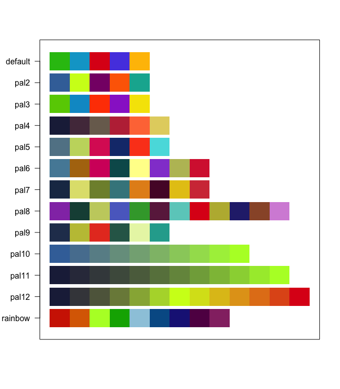<!-- -->

### Continuous palettes

``` r
display_all_jcolors_contin()
```

<!-- -->

# Discrete Color Palettes

## Use with `ggplot2`

Now use `scale_color_jcolors()` with `ggplot2`:

``` r
library(ggplot2)
library(gridExtra)

data(morley)

pltl <- ggplot(data = morley, aes(x = Run, y = Speed,
group = factor(Expt),
colour = factor(Expt))) +
    geom_line(size = 2) +
    theme_bw() +
    theme(panel.background = element_rect(fill = "grey97"),
          panel.border = element_blank(),
          legend.position = "bottom")

pltd <- ggplot(data = morley, aes(x = Run, y = Speed,
group = factor(Expt),
colour = factor(Expt))) +
    geom_line(size = 2) +
    theme_bw() +
    theme(panel.background = element_rect(fill = "grey15"),
          legend.key = element_rect(fill = "grey15"),
          panel.border = element_blank(),
          panel.grid.major = element_line(color = "grey45"),
          panel.grid.minor = element_line(color = "grey25"),
          legend.position = "bottom")

grid.arrange(pltl + scale_color_jcolors(palette = "default"),
             pltd + scale_color_jcolors(palette = "default"), ncol = 2)
```

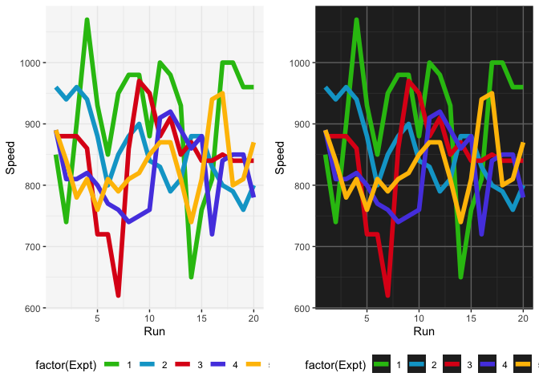<!-- -->

``` r
grid.arrange(pltl + scale_color_jcolors(palette = "pal2"),
             pltd + scale_color_jcolors(palette = "pal2"), ncol = 2)
```

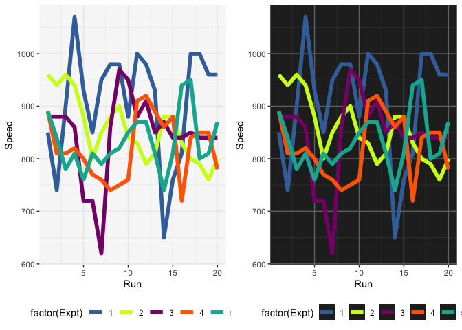<!-- -->

Color palettes can be displayed using `display_jcolors()`

## default

``` r
display_jcolors("default")
```

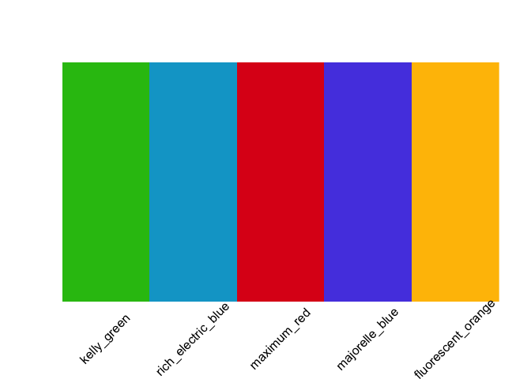<!-- -->

## pal2

``` r
display_jcolors("pal2")
```

<!-- -->

## pal3

``` r
display_jcolors("pal3")
```

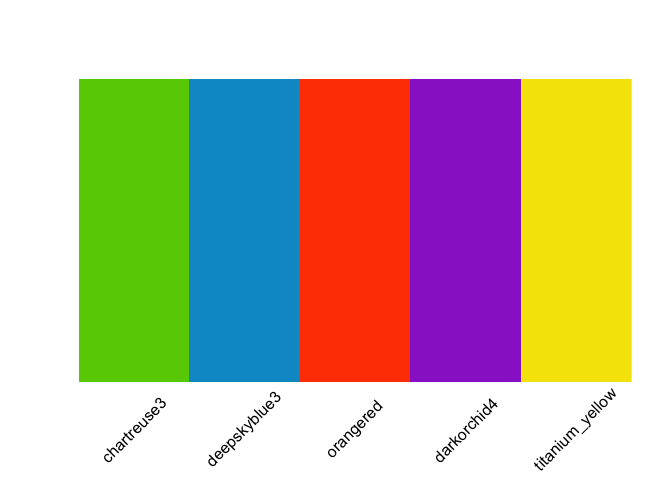<!-- -->

## pal4

``` r
display_jcolors("pal4")
```

<!-- -->

## pal5

``` r
display_jcolors("pal5")
```

<!-- -->

## pal6

``` r
display_jcolors("pal6")
```

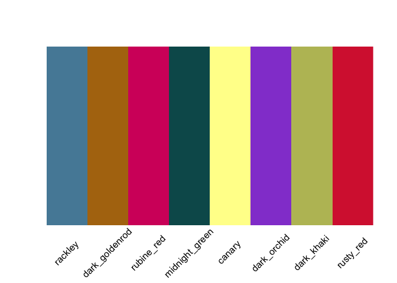<!-- -->

## pal7

``` r
display_jcolors("pal7")
```

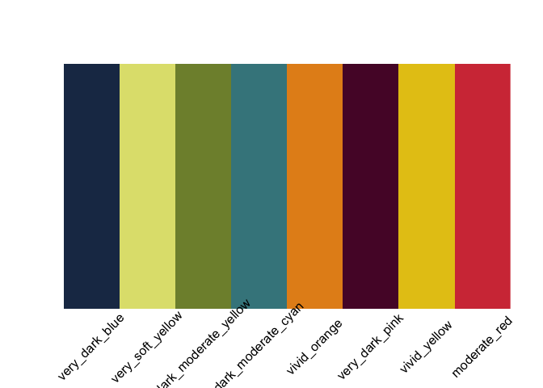<!-- -->

## pal8

``` r
display_jcolors("pal8")
```

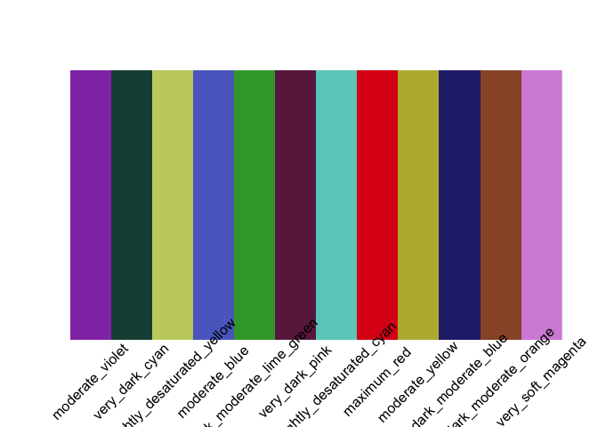<!-- -->

## pal9

``` r
display_jcolors("pal9")
```

<!-- -->

## pal10

``` r
display_jcolors("pal10")
```

<!-- -->

## pal11

``` r
display_jcolors("pal11")
```

<!-- -->

## pal12

``` r
display_jcolors("pal12")
```

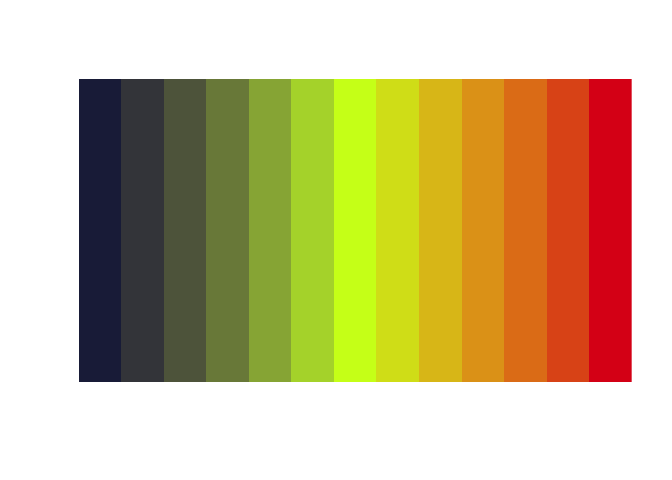<!-- -->

## rainbow

``` r
display_jcolors("rainbow")
```

<!-- -->

## More example plots

``` r
grid.arrange(pltl + scale_color_jcolors(palette = "pal3"),
             pltd + scale_color_jcolors(palette = "pal3"), ncol = 2)
```

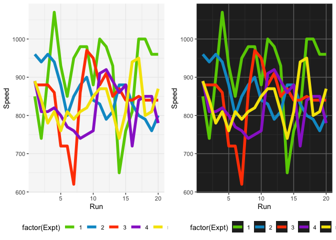<!-- -->

``` r
grid.arrange(pltl + scale_color_jcolors(palette = "pal4"),
             pltd + scale_color_jcolors(palette = "pal4") + 
                 theme(panel.background = element_rect(fill = "grey5")), ncol = 2)
```

<!-- -->

``` r
grid.arrange(pltl + scale_color_jcolors(palette = "pal5"),
             pltd + scale_color_jcolors(palette = "pal5"), ncol = 2)
```

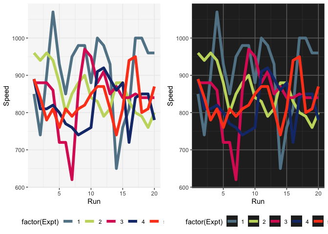<!-- -->

``` r
pltd <- ggplot(data = OrchardSprays, aes(x = rowpos, y = decrease,
group = factor(treatment),
colour = factor(treatment))) +
    geom_line(size = 2) +
    geom_point(size = 4) +
    theme_bw() +
    theme(panel.background = element_rect(fill = "grey15"),
          legend.key = element_rect(fill = "grey15"),
          panel.border = element_blank(),
          panel.grid.major = element_line(color = "grey45"),
          panel.grid.minor = element_line(color = "grey25"),
          legend.position = "bottom")


pltd + scale_color_jcolors(palette = "pal6")
```

<!-- -->

# Continuous Color Palettes

## Display all continuous palettes

``` r
display_all_jcolors_contin()
```

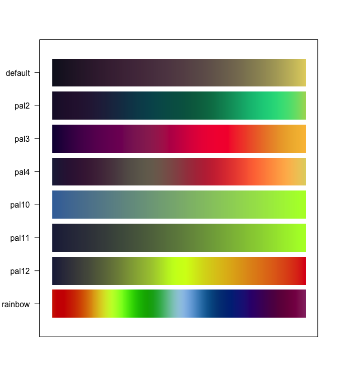<!-- -->

## Use with `ggplot2`

``` r
set.seed(42)
plt <- ggplot(data.frame(x = rnorm(10000), y = rexp(10000, 1.5)), aes(x = x, y = y)) +
      geom_hex() + coord_fixed() + theme(legend.position = "bottom")

plt2 <- plt + scale_fill_jcolors_contin("pal2", bias = 1.75) + theme_bw()
plt3 <- plt + scale_fill_jcolors_contin("pal3", reverse = TRUE, bias = 2.25) + theme_bw()
plt4 <- plt + scale_fill_jcolors_contin("pal12", reverse = TRUE, bias = 2) + theme_bw()
grid.arrange(plt2, plt3, plt4, ncol = 2)
```

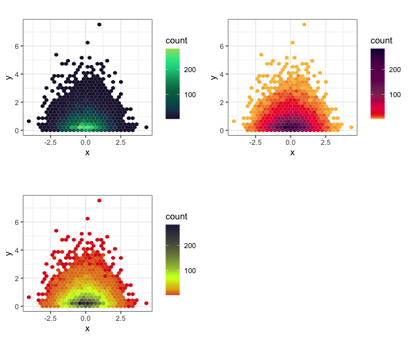<!-- -->

# `ggplot2` themes

``` r
library(scales)

p1 <- ggplot(aes(x = carat, y = price), data = diamonds) + 
      geom_point(alpha = 0.5, size = 1, aes(color = clarity)) +
      scale_x_continuous(trans = log10_trans(), limits = c(0.2, 3),
        breaks = c(0.2, 0.5, 1, 2, 3)) + 
      scale_y_continuous(trans = log10_trans(), limits = c(350, 15000),
        breaks = c(350, 1000, 5000, 10000, 15000)) +
      ggtitle('Price (log10) by Carat (log10) and Clarity') + 
      scale_color_jcolors("rainbow") +      
      theme_light_bg()


p2 <- ggplot(aes(x = carat, y = price), data = diamonds) + 
      geom_point(alpha = 0.5, size = 1, aes(color = cut)) +
      scale_x_continuous(trans = log10_trans(), limits = c(0.2, 3),
        breaks = c(0.2, 0.5, 1, 2, 3)) + 
      scale_y_continuous(trans = log10_trans(), limits = c(350, 15000),
        breaks = c(350, 1000, 5000, 10000, 15000)) +
      ggtitle('Price (log10) by Carat (log10) and Cut') + 
      scale_color_jcolors("pal4") +  
      theme_light_bg()

grid.arrange(p1, p2, ncol = 2)
```

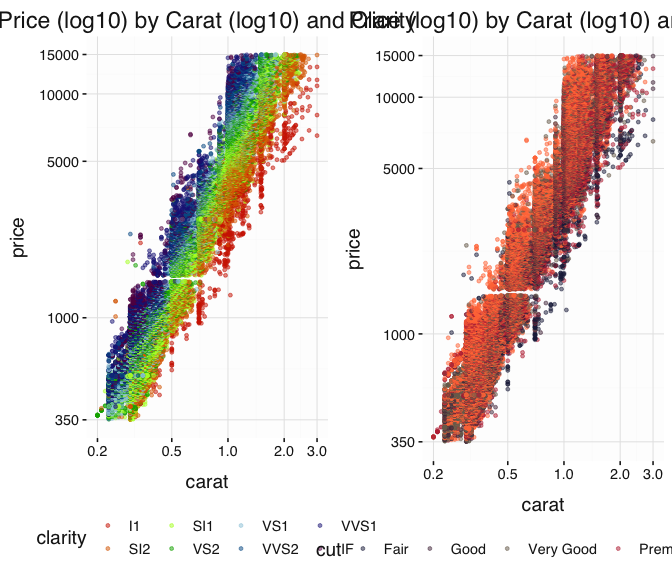<!-- -->

``` r
p1 <- ggplot(aes(x = clarity, y = price), data = diamonds) + 
      geom_point(alpha = 0.25, size = 1, position = "jitter", aes(color = log(carat + 1))) +
      scale_y_continuous(trans = log10_trans(), limits = c(350, 15000),
        breaks = c(350, 1000, 5000, 10000, 15000)) +
      ggtitle('Price (log10) by Carat (log10) and Clarity')
        
p2 <- ggplot(aes(x = clarity, y = price), data = diamonds) + 
      geom_point(alpha = 0.25, size = 1, position = "jitter", aes(color = log(carat + 1))) +
      scale_y_continuous(trans = log10_trans(), limits = c(350, 15000),
        breaks = c(350, 1000, 5000, 10000, 15000)) +
      ggtitle('Price (log10) by Carat (log10) and Clarity')

grid.arrange(p1 + scale_color_jcolors_contin("pal3", bias = 1.75) + theme_light_bg(),
             p2 + scale_color_jcolors_contin("rainbow") + theme_light_bg(), ncol = 2)
```

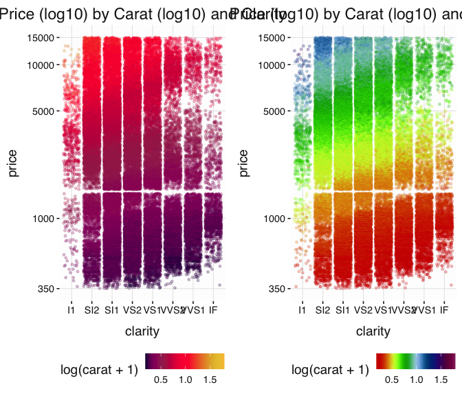<!-- -->

If the background here were dark, then this would look
nice:

``` r
grid.arrange(p1 + scale_color_jcolors_contin("pal3", bias = 1.75) + theme_dark_bg(),
             p2 + scale_color_jcolors_contin("rainbow") + theme_dark_bg(), ncol = 2)
```

<!-- -->
